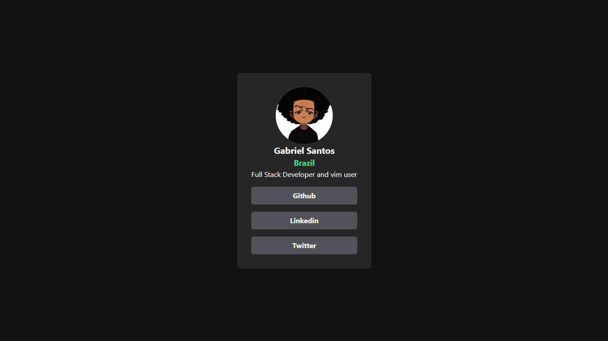

# 📇 Social Profile Card

A modern, responsive, and sleek Social Profile Card built with **React**, **TypeScript**, and **Tailwind CSS**, bundled using **Vite**.

[](https://gbcosta.github.io/social-profile-card/)
[](https://react.dev/)
[](https://tailwindcss.com/)
[](https://www.typescriptlang.org/)
[](https://vitejs.dev/)

---

## 📸 Preview

<div align="center">
  
</div>

---

## ✨ Features

- **Responsive Design:** Optimized for mobile, tablet, and desktop screens.
- **Modern UI Elements:** Sleek glassmorphism details, clean spacing, and modern typography.
- **Micro-interactions:** Smooth hover effects and interactive button transitions.
- **Type Safety:** Built with TypeScript for reliable component props and structure.
- **Optimized Build:** Leverages Vite for extremely fast Hot Module Replacement (HMR) and lightweight builds.

---

## 🛠️ Tech Stack

- **Framework:** [React 18](https://react.dev/)
- **Language:** [TypeScript](https://www.typescriptlang.org/)
- **Styling:** [Tailwind CSS v3](https://tailwindcss.com/)
- **Tooling/Bundler:** [Vite](https://vitejs.dev/)
- **Linter:** [ESLint](https://eslint.org/)

---

## 📁 Project Structure

```text
social-profile-card/
├── public/                 # Static assets (images, icons)
│   ├── home.png            # Screenshot preview
│   └── vite.svg            # Vite logo
├── src/
│   ├── assets/             # Asset files compiled by bundler
│   │   └── img.png         # Profile picture
│   ├── components/         # Reusable React components
│   │   ├── card.tsx        # Main Card container
│   │   ├── cardHeader.tsx  # Profile image, name, location, and bio
│   │   ├── cardBody.tsx    # List of social action buttons
│   │   └── cardButton.tsx  # Dynamic button component for links
│   ├── App.tsx             # Root page component
│   ├── index.css           # Global Tailwind directives & custom styles
│   ├── main.tsx            # App bootstrapping
│   └── vite-env.d.ts       # TypeScript environment declarations
├── index.html              # HTML entry point
├── package.json            # Scripts & project dependencies
├── tailwind.config.js      # Tailwind utility configuration
└── tsconfig.json           # TypeScript configuration
```

---

## 🚀 Getting Started

Follow these steps to run the project locally on your machine.

### 📋 Prerequisites

Make sure you have **Node.js** (v18+) and **pnpm** (preferred) or **npm** installed.

### ⚙️ Installation

1. Clone the repository:
   ```bash
   git clone https://github.com/gbcosta/social-profile-card.git
   cd social-profile-card
   ```

2. Install dependencies:
   ```bash
   pnpm install
   # or
   npm install
   ```

### 💻 Development

Start the local development server:
```bash
pnpm dev
# or
npm run dev
```
Open [http://localhost:5173](http://localhost:5173) in your browser to view the application.

### 📦 Build

Build the project for production:
```bash
pnpm build
# or
npm run build
```
The output will be generated in the `dist` directory, optimized and ready to host.

### 🔍 Linting

Verify code quality and style:
```bash
pnpm lint
# or
npm run lint
```

---

## 🎨 Customizing for Yourself

To use this project to build your own social profile card:

1. Replace the profile picture in `src/assets/img.png` with your own image.
2. Edit `src/components/cardHeader.tsx` to update your **Name**, **Location**, and **Bio**.
3. Edit `src/components/cardBody.tsx` to add/modify links to your own social profiles (e.g. GitHub, LinkedIn, Twitter).

---

## 📄 License

This project is open-source and free to use.
